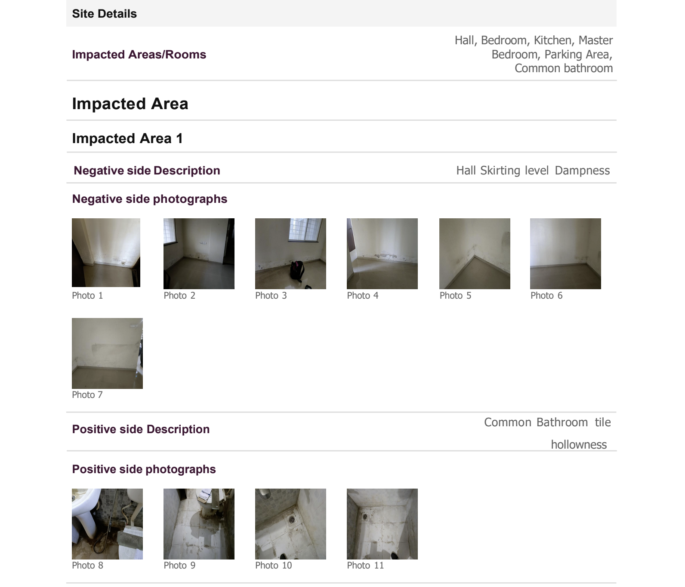
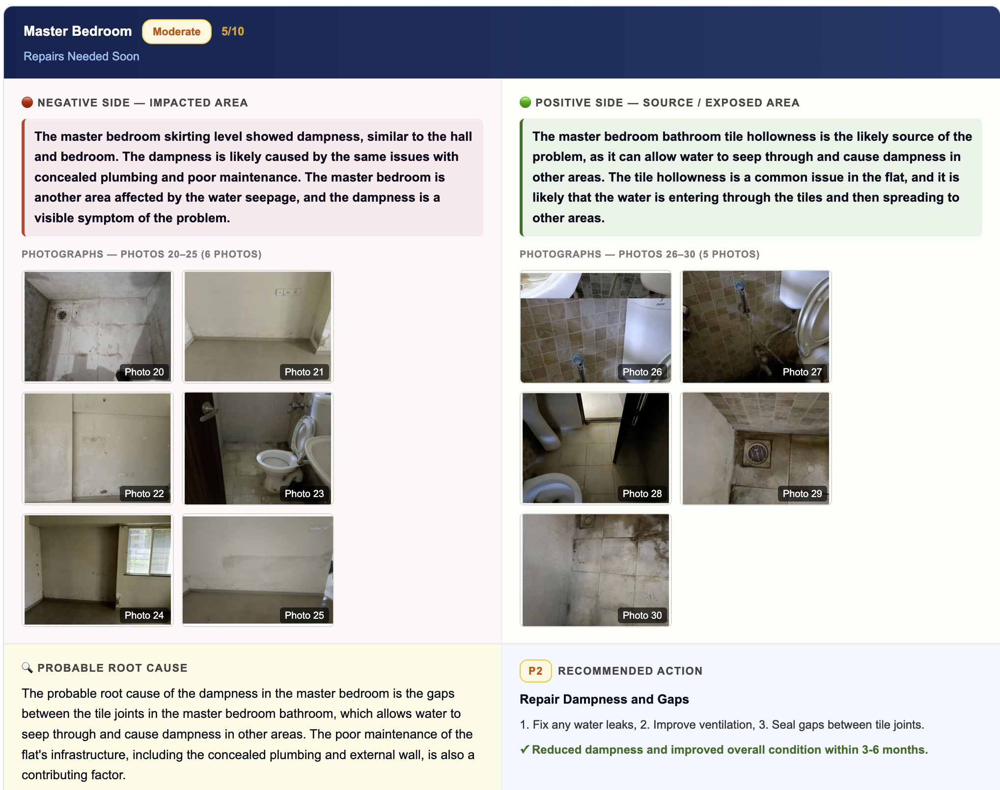
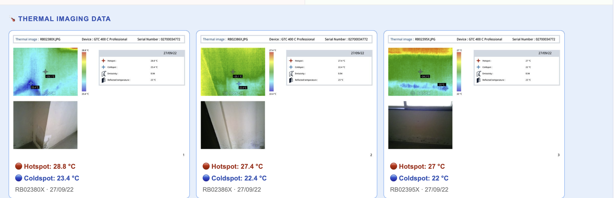
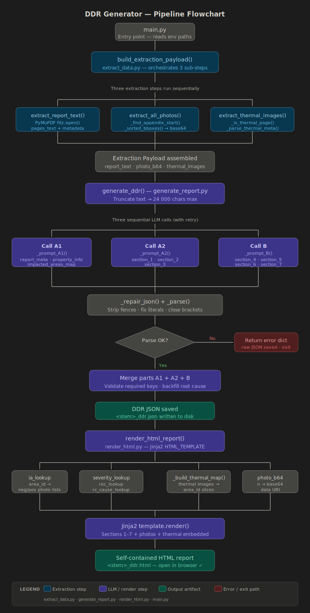

# Project
AI-powered pipeline that converts building inspection PDFs into structured diagnostic reports using automated extraction, image processing, and multi-stage LLM analysis.
# DDR Generator — Detailed Diagnostic Report Automator

**AI-powered system that converts building inspection PDFs into structured, professional diagnostic reports.**

---

## 🚀 Overview

DDR Generator is an automated pipeline that extracts, analyzes, and renders **Detailed Diagnostic Reports (DDR)** from building inspection PDFs.

It combines:

* intelligent PDF parsing
* image & thermal data extraction
* multi-stage LLM analysis
* structured HTML report generation

All processing is dynamic — no hardcoding of layouts, sections, or formats.

---

## 📸 Demo

### 📄 Input PDF

<p align="center">
  
</p>

### 📊 Generated HTML Report

<p align="center">
  
</p>


### 🔥 Thermal Analysis

<p align="center">
  
</p>


---

## ✨ What it does

Upload a building inspection PDF (optionally with thermal images), and the system generates a **self-contained HTML report** with:

* Area-wise observations (negative vs. source side)
* Embedded photographs and thermal images
* Root cause analysis per impacted area
* Severity scoring and recommended actions
* Missing information detection

Everything is inferred at runtime:

* appendix boundaries
* image layouts
* thermal pages
* impacted area mapping

---

## 🏗️ Pipeline

```
main.py
  │
  ├── [1/3] extract_report_text()
  ├── [2/3] extract_all_photos()
  └── [3/3] extract_thermal_images()
         │
         ▼
  build_extraction_payload()
         │
         ▼
  generate_ddr()
    ├── Call A1 → metadata + impacted areas
    ├── Call A2 → observations + root cause
    └── Call B  → severity + recommendations
         │
  JSON repair + validation
         │
         ▼
  render_html_report()
         │
         ▼
  Final HTML Report
```

<p align="center">
  
</p>


---

## 📁 Project Structure

```
.
├── main.py
├── extract_data.py
├── generate_report.py
├── render_html.py
├── requirements.txt
└── .env
```

---

## ⚙️ Setup & Installation

### 1. Clone Repository

```bash
git clone https://github.com/YOUR_USERNAME/ddr-generator.git
cd ddr-generator
```

---

### 2. Install Dependencies

```bash
pip install -r requirements.txt
```

---

### 3. Add Input Files

Create a `data/` folder:

```
project/
├── data/
│   ├── Sample Report.pdf
│   └── Thermal Images.pdf (optional)
```

> This folder should be in `.gitignore`

---

### 4. Configure `.env`

```env
SAMPLE_REPORT_PATH=/absolute/path/to/Sample Report.pdf
THERMAL_REPORT_PATH=/absolute/path/to/Thermal Images.pdf

REPORT_LLM_PROVIDER=groq
GROQ_API_KEY=your_api_key

OUTPUT_DIR=.
```

---

### 5. Run

```bash
python3 main.py
```

---

## 📤 Output

```
Sample Report_ddr.json
Sample Report_ddr.html
```

Open the HTML file in your browser.

---

## 🛠️ Tech Stack

| Layer            | Technology                |
| ---------------- | ------------------------- |
| PDF Parsing      | PyMuPDF                   |
| Image Processing | Pillow                    |
| Templating       | Jinja2                    |
| LLM              | Groq / OpenAI / Anthropic |
| Config           | python-dotenv             |

---

## 🧠 LLM Architecture

To avoid token limits, the pipeline splits processing into three calls:

* **A1** → metadata + impacted areas
* **A2** → observations + root cause
* **B** → severity + recommendations

All outputs are:

* merged
* validated
* repaired (JSON correction)

---

## 🔍 Extraction Logic

### 📄 Text Extraction

* Page-wise parsing
* Metadata + full-text aggregation

### 🖼️ Photo Extraction

* Appendix detection via heuristics
* Image filtering + base64 encoding

### 🔥 Thermal Detection

* Keyword-based detection
* Hotspot/coldspot parsing

---

## ⚠️ Troubleshooting

**HTML not generated**
→ Reduce `MAX_TEXT_CHARS` in `generate_report.py`

**No images extracted**
→ Adjust appendix detection or size thresholds

**Thermal images missing**
→ Add more keywords in detection logic

---

## 🛡️ Disclaimer

This tool assists professionals and does not replace expert inspection. Always review generated reports before use.

---

## 🔥 Future Improvements

* Docker support
* UI dashboard
* Batch processing
* Improved extraction accuracy

---

## 📄 License

MIT
